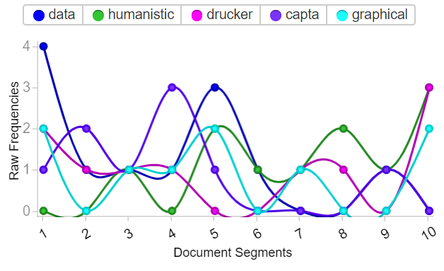
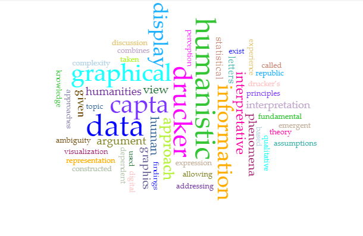

# Drucker blog post: 

In Johanna Drucker’s article tiled “Humanities Approach to Graphical Display”, Drucker goes in depth with her view on the shortfalls of data visualization and the actions put against the viewer of the data. As a main argument, she demands: “a need for human approach to the graphical expression of interpretation” in which I thoroughly agree. This statement all comes down to the primary distinction between data and capta. Through my interpretation of her contrast between the two fields, data can be defined as something that can be observed without effectively searching for it “given” as opposed to capta where information is “taken” from a source to create graphs and tables. In her reading, she pinpoints three subjects of discussion that support her argument, which I will break down and elaborate on, relating to course material. 
1.	The concept of data as a given has to be rethought through a humanist lens and characterised as capta. With this topic, Drucker advocates a shift from “knowledge to “knowing” by questioning specific fundamental assumptions based on how we know what we know. Tying back to the whole “taken” vs. “given” scenario with capta and data, its clear how humanistic inquiry acknowledges character of knowledge production, with the recognition that knowledge is constructed “taken”, and not given as a natural representation. “Information visualization” in graphical display that has been borrowed from mechanistic approaches to realism isn’t quite allowing practitioners to view the whole truth in literal assumptions of textual work, “momentary blindness” as Drucker puts it. By addressing that, several of those principles suggest that such applications to display humanities “data” aren’t needed but a new path that utilizes humanities tools and principles to constitutes capta and its display. Again, my interpretation on how to go about this issue would result in studies and findings through spatiality and temporality via history of time and its representations.

2.	The forms of graphical expression of capta need to be more nuanced to show ambiguity and complexity. With this topic, Drucker deconstructs capta and suggest that all quantification, parameterization, representation is all experimental and stands as a co “dependent relationship of emergent phenomena. In her reading, she uses some bar graphs to showcase how the principles – humanistic approach, qualitative display, and graphical information – can be demonstrated. Based on her findings which I am for, the rendering of statistical information into a graphical visual ultimately hides all aspects of original interpretative content on which that data was constructed. No “data” pre-exist their parameterization, so to set a foundation and overall purpose towards a humanistic approach to qualitative display, exposure of the contractedness of data as capta must take place. Making sense out of what she insists, quantitate information and fundamental patterns produced on the charts are already interpreted expressions but don’t necessarily present themselves as categories of those interpretations. The results are solely based on ‘ambiguity’ and ‘uncertainty’ because of the whole ‘picture’ of ‘data’ visualization. Relating back to Drucker’s thoughts on the dependent relationship of emergent phenomena, I can presume that what she means is: the whole phenomena is non-existent outside of cognitive perception, where the perception is intervening while influenced by phenomena.  
3.	The use of a humanistic approach ‘rooted in co-dependent relation between observer and experience’, needs to be expressed according to graphics built from interpretative models. In Drucker’s final topic discussion towards the argument, she’s suggesting how the idea of humanistic experience should be re-centred at the core of the interpretative model. In addition, “one of the things we must do” Drucker ads, is to replace perspective, the human scale, its point of view, the situatedness of human experience with social and cultural order along with its representation in visual and graphical form. What I see in her sub-argument is the role of ‘statistical graphics’ vs. ‘humanistic interpretative graphics’. Humanistic premises that exist replace notions of statistical concepts of self-identity that revolve co-dependence and contingencies, so ultimately, the statistical graphics that are often used are ruining the standard metrics used to abstract quantitative information from natural/human experiences and situations. 

An interesting resource which exemplifies what Drucker is addressing in her readings is a study done in the late 17th and 18th century called ‘Republic of Letters’. Comprising over 55,000 letters hosted by Stanford University, this project combines computer technology and geographical imaging to illustrate and map the complexity of international network and flow of information between intellectuals through correspondence. This simply allows scholars to make sense of large sets of historical data or capta and view patterns that would normally be difficult to explore. To achieve so, the developers used a metadata table from their database called Electronic Enlightenment which combines spatial, nominal, and temporal attributes. “Humanistic theory provides ways of thinking differently, otherwise, specific to the problems and precepts of interpretative knowing—partial, situated, enunciative, subjective, and performative” – (Drucker, J., Humanistic Theory & Digital Scholarship. 2012). With that being said, I strongly believe that a lot of the information we consume from graphical expression can really alter general perception of qualitative and quantitative findings, allowing space and time for more relevance towards a humanistic interpretation. 

 

Works Cited

Drucker, J. 2011. "Humanistic Approaches to Grahpical Display" 

Drucker, J. 2012. "Humanistic Theory and Digital Scholarship"

Coleman, N. 2013. "Mapping the Repulic of Letters". Standford University.

